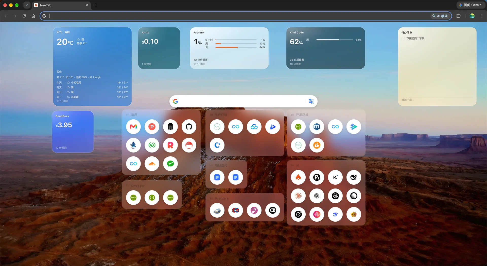

# NewTab

极简的浏览器新标签页：壁纸 + 搜索打底，常用链接与轻量小组件随手可及。Chrome / Firefox（Manifest V3）。



## 特性

**首屏**

- 沉浸式壁纸 + 搜索框，圆角、上下位置、是否始终居中都可调
- 首屏小组件，可拖拽摆放，支持小 / 中 / 大尺寸档，从组件库添加：
  - 天气：Open-Meteo 数据源，留空城市自动定位，定位失败回落西安
  - 待办清单
  - AI 余额与用量：DeepSeek、Kimi Code、Factory、Antix
- 壁纸：Bing 每日图（可切换）、自定义壁纸，缩略图优先、高清后台补全

**搜索**

- 内置 Google、百度、必应、DuckDuckGo、哔哩哔哩、知乎、豆瓣等，以及豆包、元宝、DeepSeek、ChatGPT、Gemini 等 AI 引擎
- 支持自定义搜索引擎；对不吃 URL 参数的引擎，会把关键词自动填进它的输入框
- 搜索框内切换搜索引擎 / 翻译源，带 `Shift + Alt + 数字` 快捷键

**链接**

- 抽屉分组管理，拖拽排序，首屏快捷方式自由摆放
- 任意网页右键「收藏到抽屉」
- 链接图标自动抓取、缓存、懒加载，支持批量重新获取

**数据**

- 本地优先（IndexedDB / Dexie），支持导出 / 导入
- WebDAV 与 GitHub Gist 两条同步通道

## 安装

### Chrome

1. 在 [Releases](https://github.com/postdare/new-tab/releases) 下载 `new-tab-vX.Y.Z-chrome.zip` 并解压

2. 打开 `chrome://extensions`，右上角开启「开发者模式」

3. 点击「加载已解压的扩展程序」，选择解压出的目录

### Firefox

先本地构建（见下），然后打开 `about:debugging#/runtime/this-firefox`，选择「临时载入附加组件」，指向 `dist/manifest.json`。

## 开发

```bash
yarn              # 安装依赖
yarn d            # watch 构建（改完在扩展页点刷新）
yarn dev          # Vite dev server
yarn build        # Chrome 构建到 dist/
yarn build:firefox
yarn lint         # 也可以 yarn lint:warn 只看告警
yarn format
```

## 目录结构

```
src/newtab      新标签页页面：MobX stores、scenes（首屏 / 抽屉 / 首选项 / 组件库）
src/newtab/widgets  首屏小组件；新增一种只需写一个文件夹，再登记到 widgets/registry.js
src/content     注入页面的内容脚本（特殊搜索引擎、favicon 探测）
src/background  Service Worker（右键收藏、数据同步）
docs/images     README 截图
```

## 更新日志

见 [`src/updateRecords.js`](./src/updateRecords.js)，或扩展内「关于」页。

## 许可

MIT — 见 [LICENSE](./LICENSE)。本项目基于 [mumingfang/jvmaoTab](https://github.com/mumingfang/jvmaoTab)（MIT License）二次开发。
